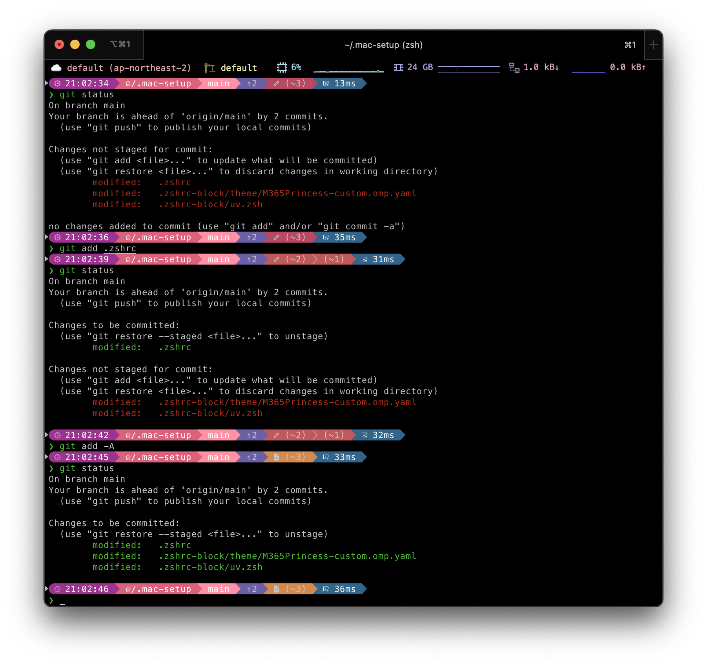

<!-- https://badges.pages.dev/ -->
<!-- https://ileriayo.github.io/markdown-badges/#markdown-badges -->


# .mac-setup

From factory reset to below example


## Fundamentalities

- [Homebrew](./guide/brew.md): Package manager for macOS (or Linux)

- [Stow](./guide/brew.stow.md): Symlink farm manager

- Archivers: `brew install zip gnu-tar`

- Parsers: `brew install base64 tree grep jq yq awk fzf jfryy/tap/qq`

- Network: `brew install curl wget`

- Beautify: [`brew install bat bat-extras ripgrep`](https://github.com/eth-p/bat-extras#readme)

  > allow command: `bat`, `batdiff`, `batgrep`(with [rg][Page-RG]), `batwatch`, `prettybat`

  [Page-RG]: https://github.com/burntsushi/ripgrep?tab=readme-ov-file#screenshot-of-search-results

## CLI components

- [iTerm2](./guide/brew.iterm2.md): Alternative terminal for macOS

- [NeoVim](./guide/brew.neovim.md): Vim-based text editor

- [git](./guide/brew.git.md): Distributed version control system

- [oh-my-zsh](./guide/curl.oh-my-zsh.md): Zsh config manager

- [oh-my-posh](./guide/brew.oh-my-posh.md): Prompt theme engine for any shell

- ~~[pyenv](./guide/brew.pyenv.md)~~
  ➡︎ [uv](./guide/brew.uv.md): Simple python version manager

- [nvm](./guide/brew.nvm.md): Simple node version manager

- [sdkman](./guide/brew.sdk.md): Software development kit manager

- [goenv](./guide/brew.goenv.md): Simple go version manager

- [tfenv](./guide/brew.tfenv.md): Simple terraform version manager

- [tofuenv](./guide/brew.tofuenv.md): Simple opentofu version manager

- [aws](./guide/brew.aws.md): Command line interface for AWS cloud

- [q](./guide/brew.amazon-q.md): Command line interface for AWS developers

## Configurations

- Clone dotfiles repository to your home directory:

  ```bash
  git clone https://github.com/SPONGE-JL/.mac-setup "${HOME}/.mac-setup"
  cd "${HOME}/.mac-setup"
  ```

- Enable local pre-commit hooks:

  ```bash
  pre-commit install --hook-type pre-commit
  pre-commit install --hook-type commit-msg
  ls -sthl .git/hooks | grep -v sample
  ```

- Install latest pre-commit hooks:

  ```bash
  pre-commit autoupdate
  pre-commit install --install-hooks
  ```

- Make symbolic links at once: `./enable.sh`

- Reset: `disable.sh`

## GUI components

- [Itsycal](https://www.mowglii.com/itsycal/):

  ```bash
  brew install --cask itsycal
  open '/Applications/Itsycal.app'
  ```

- [Raycast](https://www.raycast.com/):

  ```bash
  brew install --cask raycast
  open '/Applications/Raycast.app'
  ```

- [Rectangle Mac](https://rectangleapp.com/):

  ```bash
  brew install --cask rectangle
  open '/Applications/Rectangle.app'
  ```

- [Sublime Text](https://www.sublimetext.com/):

  ```bash
  brew install --cask sublime-text
  open '/Applications/Sublime Text.app'
  subl --version
  ```

- [Hidden bar](https://github.com/dwarvesf/hidden)

  ```bash
  brew install --cask hiddenbar
  # https://github.com/dwarvesf/hidden/issues/201#issuecomment-1115895973
  sudo xattr -r -d com.apple.quarantine '/Applications/Hidden Bar.app'
  open '/Applications/Hidden Bar.app'
  ```

- [draw.io](https://www.drawio.com/)

  ```bash
  brew install --cask drawio
  open '/Applications/draw.io.app'
  ```

- [ExcallidrawZ](https://github.com/chocoford/ExcalidrawZ#readme)
  with [Converter](https://github.com/sindrel/excalidraw-converter#readme)

  ```bash
  brew install --cask excalidrawz
  open '/Applications/ExcalidrawZ.app'

  brew install excalidraw-converter
  exconv version
  ```

## AppStore

- [Amphetamine](https://apps.apple.com/us/app/amphetamine/id937984704?mt=12): Powerful keep-awake utility

- [ScreenBrush](https://apps.apple.com/us/app/screenbrush/id1233965871?mt=12): Teach and show using draw

- [Amazon Kindle](https://apps.apple.com/us/app/amazon-kindle/id302584613): Read eBooks & Magazines via Amazon Shopping

## Binary components

- [Obsidian](https://obsidian.md/download): Sharpen your thinking

- [Visual Studio Code](https://code.visualstudio.com/):

  1. [Download binary to install](https://code.visualstudio.com/download)

  2. Enable [cli `code`](https://code.visualstudio.com/docs/setup/mac#_launching-from-the-command-line)

- [Jetbrain Toolbox](https://www.jetbrains.com/lp/toolbox/)
  with [CLI `idea`](https://www.jetbrains.com/help/idea/working-with-the-ide-features-from-command-line.html#toolbox):

  ```bash
  brew install --cask jetbrains-toolbox
  open '/Applications/JetBrains Toolbox.app'
  ```

- [Rancher Desktop](https://docs.rancherdesktop.io/):

  1. [Download binary to install](https://rancherdesktop.io/)

  2. Choose `dockerd (moby)` runtime with manual `PATH` valiable setting in [`.zshrc`](.zshrc#L55)

  3. Check

      ```bash
      ls -shlt ${HOME}/.rd/bin

      docker version
      docker compose version
      kubectl version
      helm version
      ```

## License

Free to copy or folk based on [MIT License](./LICENSE)
